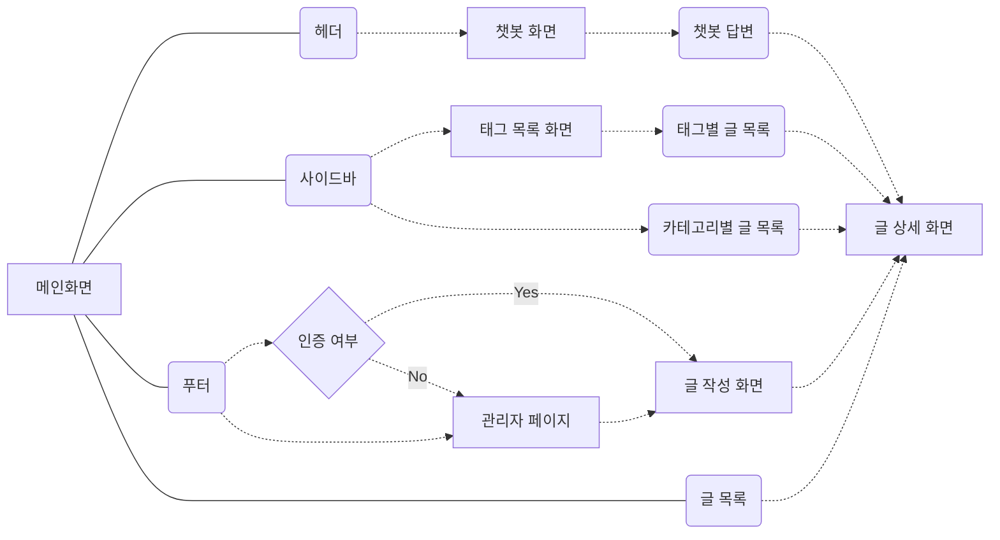

# Blog-ChatBot Flow-Chart

### 개발 환경

##### NextJS / ESlint-Prettier / TailwindCSS / Supabase / Tanstack-Query

### 1. 페이지 / 레이아웃 구현

###### - NextJS라우팅 / 테일윈드 반응형 레이아웃

###### - Sidebar / Dynamic Route

###### - common IconButton Component

##

### 2. write / detail page

###### - 카테고리 및 태그 입력창(react-select) / 글 내용 작성(react-md-editor) / 글 작성 요청((pagesRouter용이)formidable) / 글 디테일 페이지(date-fns / react-markdown-preview)

###### - supabase connect / Post (table, column 생성)

### 2. List page

###### - 서버 상태관리를 위한 Tanstack-Query 사용

###### - getServerSideProps => useQuery 변경

###### - pageRouter dynamic route Category/Tag page

###### - Tanstack-Query infinity-scroll / react-intersection-observer를 이용한 무한 스크롤 구현

###### - mainPage, CategoryPage, TagPage common component apply

### 3. ChatBot 구현

###### - OpenAi API Context -> 요청을 보낼 때 메시지 필드를 채우는데 사용

###### - 메시지 목록 렌더 -> 채팅을 함에 따라 메시지 컴포넌트를 추가해서 렌더에 활용
