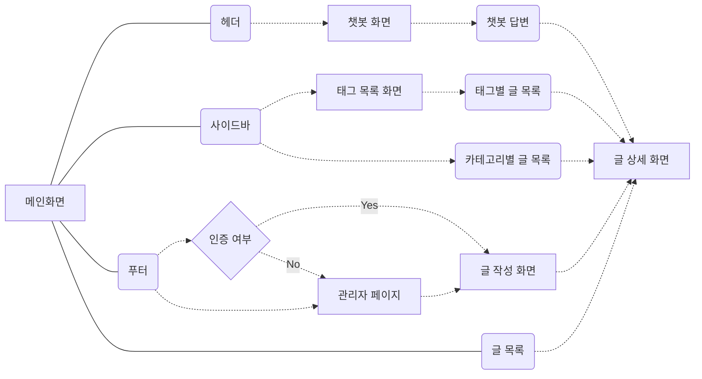

# Blog-ChatBot Flow-Chart

### 개발 환경

##### NextJS / ESlint-Prettier / TailwindCSS / Supabase

### 1. 페이지 / 레이아웃 구현

###### - NextJS라우팅 / 테일윈드 반응형 레이아웃

###### - Sidebar / Dynamic Route

###### - common IconButton Component
