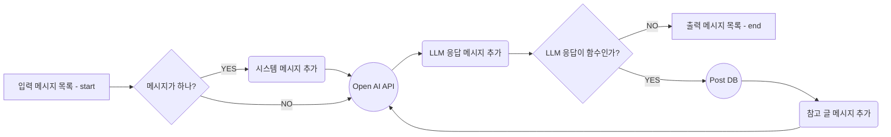

### 챗봇 답변 플로우

```mermaid
graph LR
  Input["입력 메시지 목록 - start"]
  Output["출력 메시지 목록 - end"]
  LLM((Open AI API))
  PostDB((Post DB))
  IsFirst{메시지가 하나?}
  System(시스템 메시지 추가)
  Response(LLM 응답 메시지 추가)
  IsFunc{LLM 응답이 함수인가?}
  PostResult(참고 글 메시지 추가)

  Input --> IsFirst
  IsFirst --> |YES|System --> LLM
  IsFirst --> |NO|LLM

  LLM --> Response
  Response --> IsFunc

  IsFunc --> |YES|PostDB --> PostResult --> LLM
  IsFunc --> |NO|Output
```
